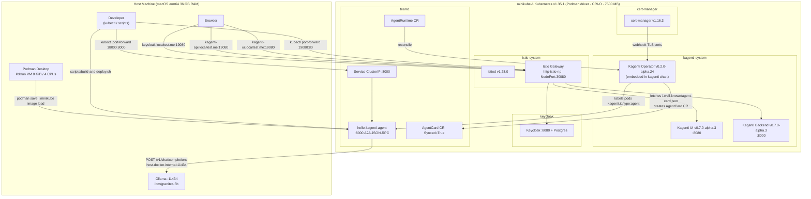
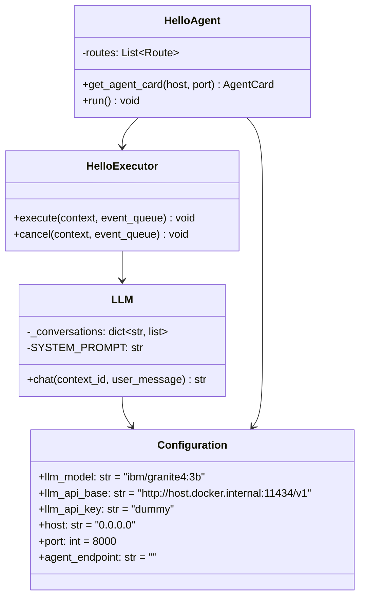
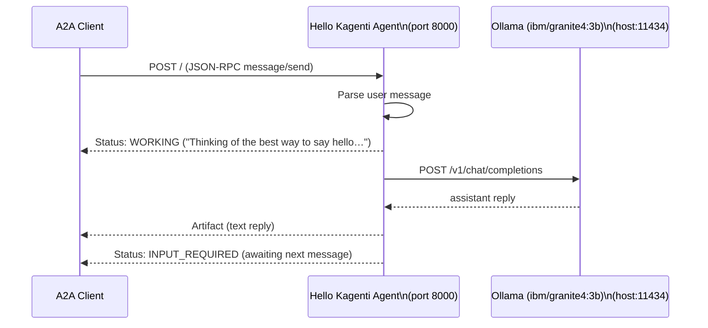
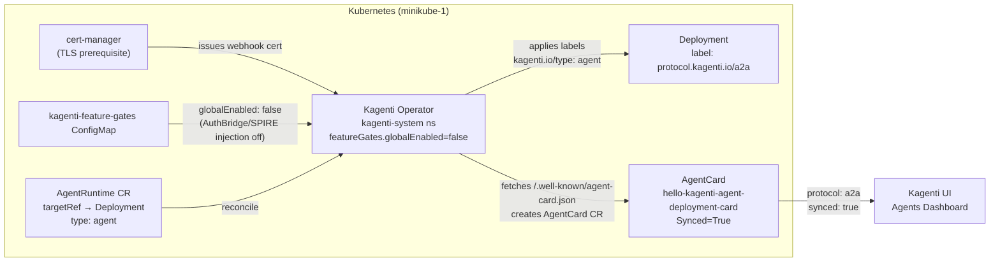

# Architecture — Hello Kagenti Agent

## Overview

This project implements a minimal **A2A (Agent-to-Agent) greeting agent** deployed on the full
**Kagenti platform stack** running locally on minikube.

The full stack runs locally:
- **macOS host** — Podman Desktop (builds + runs the libkrun VM), Ollama (LLM at `:11434`)
- **minikube-1** (Podman driver, CRI-O, Kubernetes v1.35.1) — full Kagenti platform + agent workload

### Deployed Helm releases

| Release | Chart | Version | Namespace |
|---|---|---|---|
| `istio-base` | `base` | 1.28.0 | `istio-system` |
| `istiod` | `istiod` | 1.28.0 | `istio-system` |
| `kagenti-deps` | `kagenti-deps` | 0.1.0 | `kagenti-system` |
| `kagenti` | `kagenti` | 0.7.0-alpha.2 | `kagenti-system` |

The Kagenti Operator is **embedded inside the `kagenti` Helm release** (not a separate install when
using the full platform chart). The standalone operator install (used in `setup-cluster.sh`) is only
needed when running without the full platform.

---

## High-Level Architecture



---

## Component Diagram



---

## Request Flow



---

## Kagenti Operator Integration



> **`globalEnabled: false`** — The Kagenti AuthBridge sidecar injection (SPIRE + Envoy proxy) is
> disabled. This is required when running without a full SPIRE deployment. The agent pod runs as a
> single container with no sidecar. To re-enable: patch the `kagenti-feature-gates` ConfigMap in
> `kagenti-system` and set `globalEnabled: true` — but only after deploying SPIRE.

### Kagenti Operator — Install Notes

The operator image (`ghcr.io/kagenti/kagenti-operator`) is **private**. It must be built from source:

```bash
# Build from source (arm64 macOS)
cd _sources/kagenti-operator-src/kagenti-operator-main
podman build --platform linux/arm64 \
  -t localhost/kagenti-operator:v0.2.0-alpha.24 -f Dockerfile .

# Load into minikube via tar (minikube image load requires a tar on Podman)
podman save localhost/kagenti-operator:v0.2.0-alpha.24 -o /tmp/op.tar
minikube image load /tmp/op.tar --profile minikube-1

# Install via Helm (values.yaml image path: controllerManager.container.image)
cd kagenti-hello-agent
helm install kagenti-operator \
  ../_sources/kagenti-operator-src/kagenti-operator-main/charts/kagenti-operator \
  --namespace kagenti-system --create-namespace \
  --kube-context minikube-1 \
  --set controllerManager.container.image.repository=localhost/kagenti-operator \
  --set controllerManager.container.image.tag=v0.2.0-alpha.24 \
  --set controllerManager.container.image.pullPolicy=Never \
  --wait --timeout=120s
```

> **Note (Podman + minikube):** `minikube image load <image-name>` fails when using the Podman driver
> because minikube cannot reach the Podman socket directly. Always save to a `.tar` file first and
> load the tar — this is what all scripts in this project do.

### Key Labels Applied by the Operator

| Label | Value | Purpose |
|---|---|---|
| `protocol.kagenti.io/a2a` | `""` | Marks this workload as an A2A-speaking agent |
| `kagenti.io/type` | `agent` | Triggers AuthBridge sidecar injection (if SPIRE enabled) |
| `app.kubernetes.io/managed-by` | `kagenti-operator` | Ownership tracking on AgentCard |

### AgentRuntime Status (observed)

| Condition | Status | Reason |
|---|---|---|
| `TargetResolved` | `True` | Deployment `hello-kagenti-agent` found |
| `ConfigResolved` | `True` | Configuration resolved successfully |
| `Ready` / `Phase` | `True` / `Active` | Workload configured with config-hash |
| AgentCard `Synced` | `True` | Operator fetched agent card successfully |
| AuthBridge injection | Disabled | `globalEnabled: false` in feature-gates ConfigMap |

---

## Observability

### Current state

| Tool | Status | Notes |
|---|---|---|
| Istio service mesh (istiod) | ✅ Running | Traffic metrics available once Kiali enabled |
| Kiali | ⚠️ Disabled | `components.kiali.enabled: false` in `kagenti-deps` |
| Prometheus / OTEL | ⚠️ Disabled | `components.otel.enabled: false` in `kagenti-deps` |

### Network routing — how `localtest.me` works

All UIs route through a **single Istio gateway** (`http-istio-np`, NodePort 30080).
`localtest.me` always resolves to `127.0.0.1` — which maps to `localhost:19080` via port-forward.

```
Browser  →  localhost:19080  →  kubectl port-forward  →  http-istio-np:80
                                                              ↓
                              Host: kagenti-ui.localtest.me → kagenti-ui:8080
                              Host: kagenti-api.localtest.me → kagenti-backend:8000
                              Host: keycloak.localtest.me    → keycloak-service:8080
```

The minikube node IP (`192.168.49.2`) is **not reachable** from macOS when using the Podman driver —
port-forward is the only access method.

### Enable Kiali

```bash
helm --kube-context minikube-1 upgrade kagenti-deps \
  _sources/kagenti-operator-src/kagenti-operator-main/charts/kagenti-deps \
  -n kagenti-system \
  --reuse-values \
  --set components.kiali.enabled=true \
  --set components.otel.enabled=true \
  --wait --timeout=300s

# Then access Kiali:
kubectl --context minikube-1 port-forward \
  -n istio-system svc/kiali 20001:20001
# http://localhost:20001
```

---

## File Structure

```
kagenti-hello-agent/
├── src/
│   └── hello_agent/
│       ├── __init__.py         # Package init
│       ├── agent.py            # A2A server entry point (AgentCard + routes + executor)
│       ├── llm.py              # Async OpenAI-compat LLM client + conversation memory
│       └── configuration.py   # Pydantic settings (env vars)
├── k8s/
│   └── deploy.yaml             # Namespace + Deployment + Service + AgentRuntime CR
├── scripts/
│   ├── setup-cluster.sh       # Resize Podman machine + start minikube + cert-manager + operator
│   ├── build-and-deploy.sh    # Build image → load into minikube → kubectl apply
│   ├── test-agent.sh          # Port-forward → health + AgentCard + JSON-RPC smoke tests
│   └── teardown.sh            # kubectl delete cleanup
├── Docs/
│   ├── Architecture.md        # This file — full Mermaid diagrams, platform stack
│   └── AccessGuide.md         # All port-forward commands, UIs, and observability options
├── Dockerfile                 # uv/Python 3.12 bookworm-slim, non-root UID 1001
├── pyproject.toml             # Python project + a2a-sdk>=1.1.0 + openai>=2.41 deps
└── .gitignore
```

---

## Environment Variables

| Variable | Default | Source |
|---|---|---|
| `LLM_MODEL` | `ibm/granite4:3b` | `k8s/deploy.yaml` env |
| `LLM_API_BASE` | `http://host.docker.internal:11434/v1` | `k8s/deploy.yaml` env |
| `LLM_API_KEY` | `dummy` | `k8s/deploy.yaml` env |
| `HOST` | `0.0.0.0` | `k8s/deploy.yaml` env |
| `PORT` | `8000` | `k8s/deploy.yaml` env |
| `AGENT_ENDPOINT` | *(empty — auto)* | `k8s/deploy.yaml` env |

> `host.docker.internal` resolves to the Mac host IP (`192.168.127.254`) inside minikube via Podman Desktop's `gvproxy` — no extra host networking configuration required.
