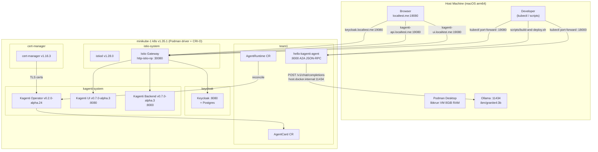

# Hello Kagenti Agent

A minimal **A2A (Agent-to-Agent) greeting agent** deployed on a local Kubernetes cluster managed by the full [Kagenti](https://github.com/kagenti/kagenti) platform stack.

The agent:
- Exposes a JSON-RPC endpoint compliant with the [Google A2A protocol](https://github.com/google-deepmind/a2a-python)
- Greets users by name and holds a short friendly conversation
- Calls an Ollama-compatible LLM (`ibm/granite4:3b`) for its responses
- Gets automatically discovered by the Kagenti Operator via an `AgentRuntime` CR
- Is visible in the **Kagenti Agents Dashboard** at `http://kagenti-ui.localtest.me:19080`

---

## Architecture



See [Docs/Architecture.md](Docs/Architecture.md) for full component and sequence diagrams.

---

## Prerequisites

| Tool | Purpose | Install |
|---|---|---|
| [Podman Desktop](https://podman-desktop.io/) | Container build + K8s driver | [podman-desktop.io](https://podman-desktop.io/) |
| [minikube](https://minikube.sigs.k8s.io/) | Local K8s cluster | `brew install minikube` |
| [kubectl](https://kubernetes.io/docs/tasks/tools/) | K8s CLI | `brew install kubectl` |
| [Helm](https://helm.sh/) | Operator install | `brew install helm` |
| [Ollama](https://ollama.com/) | Local LLM | `brew install ollama` |
| Python ≥ 3.11 | Agent runtime | [python.org](https://www.python.org/) |

---

## ⚠️ Podman Machine Resize (macOS — required before first run)

The default Podman machine is allocated only **2 GiB RAM**, which is insufficient for minikube.
You must resize it to at least **8 GiB before starting the cluster**.

> minikube reports: `Podman has only 1941MB memory but you specified 8192MB`
> even though your Mac has plenty of RAM — this is the Podman VM limit, not the host limit.

```bash
# Stop the Podman machine
podman machine stop podman-machine-default

# Resize (arm64 macOS — libkrun VM type)
podman machine set --memory 8192 --cpus 4 podman-machine-default

# Start again
podman machine start podman-machine-default

# Verify — should now show 8GiB
podman machine list
```

> **Note:** Due to libkrun overhead (~300 MB), specify **7500 MB** when starting minikube
> (not 8192), even though the machine is set to 8192:
> ```bash
> minikube start --profile minikube-1 --driver=podman \
>   --container-runtime=cri-o --memory=7500 --cpus=4
> ```

---

## Setting Up the Cluster (one-time)

Use the automated script (handles resize, cluster creation, cert-manager, and operator install):

```bash
cd kagenti-hello-agent
./scripts/setup-cluster.sh
```

Or follow the manual steps below.

### 1. Resize Podman machine & start minikube

```bash
# (See ⚠️ section above for resize steps)

minikube start \
  --profile minikube-1 \
  --driver=podman \
  --container-runtime=cri-o \
  --memory=7500 \
  --cpus=4
```

### 2. Install cert-manager (required by the Kagenti Operator webhook)

```bash
kubectl apply -f \
  https://github.com/cert-manager/cert-manager/releases/download/v1.16.3/cert-manager.yaml

kubectl --context minikube-1 -n cert-manager \
  wait deployment/cert-manager-webhook \
  --for=condition=Available --timeout=120s
```

### 3. Build and install the Kagenti Operator from source

The Kagenti Operator image on `ghcr.io` is **private**. Build it locally and load into minikube:

```bash
# Unzip / clone the operator source (already in _sources/ in this repo)
cd _sources/kagenti-operator-src/kagenti-operator-main

# Build the operator image with Podman (arm64)
podman build \
  --platform linux/arm64 \
  -t localhost/kagenti-operator:v0.2.0-alpha.24 \
  -f Dockerfile .

# Save to tar and load into minikube (direct podman→minikube, no registry needed)
podman save localhost/kagenti-operator:v0.2.0-alpha.24 -o /tmp/kagenti-operator.tar
minikube image load /tmp/kagenti-operator.tar --profile minikube-1

# Install via Helm from local chart
cd kagenti-hello-agent
helm install kagenti-operator \
  ../_sources/kagenti-operator-src/kagenti-operator-main/charts/kagenti-operator \
  --namespace kagenti-system \
  --create-namespace \
  --kube-context minikube-1 \
  --set controllerManager.container.image.repository=localhost/kagenti-operator \
  --set controllerManager.container.image.tag=v0.2.0-alpha.24 \
  --set controllerManager.container.image.pullPolicy=Never \
  --wait --timeout=120s
```

### 4. Install the Ollama model

```bash
ollama pull ibm/granite4:3b
# Ollama Desktop keeps it running, or: ollama serve
```

---

## Quick Start

### 1. Navigate to the project

```bash
cd kagenti-hello-agent
```

### 2. Build, load into minikube, and deploy — one command

```bash
./scripts/build-and-deploy.sh
```

What it does:
1. Builds the container image with `podman build --platform linux/arm64`
2. Saves the image as a `.tar` and loads it into minikube with `minikube image load`
3. Runs `kubectl apply -f k8s/deploy.yaml` which creates:
   - `Namespace: team1`
   - `Deployment: hello-kagenti-agent`
   - `Service: hello-kagenti-agent`
   - `AgentRuntime: hello-kagenti-agent-runtime`

### 3. Check deployment status

```bash
# Pods
kubectl get pods -n team1 --context minikube-1

# AgentRuntime registered with operator
kubectl get agentruntime -n team1 --context minikube-1

# AgentCard auto-created by operator
kubectl get agentcards -n team1 --context minikube-1

# Logs
kubectl logs -f -l app.kubernetes.io/name=hello-kagenti-agent -n team1 --context minikube-1
```

### 4. Test the agent

```bash
./scripts/test-agent.sh
```

The script:
1. Port-forwards `svc/hello-kagenti-agent` → `localhost:18000`
2. Calls `/health`
3. Fetches `/.well-known/agent-card.json` (agent card)
4. Sends `"Hello!"` via A2A JSON-RPC
5. Sends `"My name is Alice!"` via A2A JSON-RPC

#### Manual test (after `kubectl port-forward`)

```bash
# Port-forward (using 18000 — avoid macOS AirDrop :5000 and AirPlay :7000)
kubectl port-forward svc/hello-kagenti-agent 18000:8000 -n team1 --context minikube-1 &

# Health check
curl http://localhost:18000/health

# Agent Card (a2a-sdk registers at this path)
curl http://localhost:18000/.well-known/agent-card.json | python3 -m json.tool

# A2A message
curl -X POST http://localhost:18000/ \
  -H "Content-Type: application/json" \
  -d '{
    "jsonrpc": "2.0",
    "id": "test-1",
    "method": "message/send",
    "params": {
      "message": {
        "role": "user",
        "parts": [{"kind": "text", "text": "Hello, I am Bob!"}],
        "messageId": "msg-001"
      }
    }
  }'
```

#### Test from inside the cluster (no port-forward)

```bash
kubectl run curl-pod -i --tty --rm \
  --image=curlimages/curl:8.1.2 -n team1 -- \
  curl -sS -X POST http://hello-kagenti-agent.team1.svc.cluster.local:8000/ \
    -H "Content-Type: application/json" \
    -d '{"jsonrpc":"2.0","id":"test-1","method":"message/send","params":{"message":{"role":"user","parts":[{"kind":"text","text":"Hello Kagenti!"}],"messageId":"msg-001"}}}'
```

---

## Accessing the Dashboards

All UIs are served through the Istio gateway using `localtest.me` hostname routing.
`localtest.me` always resolves to `127.0.0.1` — so a **single `kubectl port-forward`** is the only
thing you need. Since port 8080 is already in use, use port **19080**.

### Start the gateway port-forward (keep this running in a terminal)

```bash
kubectl --context minikube-1 port-forward \
  -n kagenti-system svc/http-istio-np 19080:80
```

### Kagenti Agents Dashboard

Open in your browser:

```
http://kagenti-ui.localtest.me:19080
```

- **Agents tab** — lists all registered agents including `hello-kagenti-agent`
- **Agent detail** — shows the AgentCard (name, skills, protocol, endpoint)
- Auth is **disabled** (`ui.auth.enabled: false`) — no login required

### Kagenti API (REST)

```
http://kagenti-api.localtest.me:19080/api/v1/agents
```

### Keycloak Admin Console

```
http://keycloak.localtest.me:19080
```

Default admin credentials are set in the Helm values (check `kagenti-deps` release).

### Hello Agent direct access

```bash
# Open a separate terminal
kubectl --context minikube-1 port-forward \
  -n team1 svc/hello-kagenti-agent 18000:8000

# Then test:
curl http://localhost:18000/health
curl http://localhost:18000/.well-known/agent-card.json | python3 -m json.tool
```

---

## Observability

### Current status

The observability components (Kiali, Prometheus, Grafana, Jaeger/OpenTelemetry) are **installed but
currently disabled** in the `kagenti-deps` Helm release. The Kagenti UI Observability tab will show
a message to configure them.

```bash
# Confirm current state
helm --kube-context minikube-1 get values kagenti-deps -n kagenti-system
# components.kiali.enabled: false
# components.otel.enabled: false
```

### What you see in the Kagenti UI Observability tab

The tab shows:
> *"Ensure that the observability tools (Kiali for service mesh) are properly configured
> and accessible from your environment."*

This means Kiali is not yet deployed. The Istio service mesh **is** running (istiod v1.28.0) and
will provide traffic data to Kiali once enabled.

### Enable Kiali + Prometheus (optional)

Kiali requires Prometheus to be running. Enable both with a Helm upgrade:

```bash
helm --kube-context minikube-1 upgrade kagenti-deps \
  _sources/kagenti-operator-src/kagenti-operator-main/charts/kagenti-deps \
  -n kagenti-system \
  --reuse-values \
  --set components.kiali.enabled=true \
  --set components.otel.enabled=true \
  --wait --timeout=300s
```

> **RAM note:** Kiali + Prometheus adds ~1 GiB RAM. Ensure Podman machine has at least 8 GiB
> (already resized) and the cluster has headroom.

Once deployed, access Kiali via its own port-forward:

```bash
kubectl --context minikube-1 port-forward \
  -n istio-system svc/kiali 20001:20001
# Open: http://localhost:20001
```

Kiali shows:
- **Service graph** — live traffic topology between services
- **Workloads** — `hello-kagenti-agent` pod health and traffic
- **Istio config** — VirtualServices, Gateways, HTTPRoutes
- **Traces** — if Jaeger/OTEL is also enabled

### Agent logs (no Kiali needed)

You can observe the agent behaviour directly from pod logs:

```bash
# Tail live agent logs
kubectl --context minikube-1 logs -f \
  -l app.kubernetes.io/name=hello-kagenti-agent \
  -n team1

# Operator reconciliation logs
kubectl --context minikube-1 logs -f \
  -l app.kubernetes.io/name=kagenti-operator-chart \
  -n kagenti-system
```

### Full observability stack installed (current cluster components)

| Component | Namespace | Status | Access |
|---|---|---|---|
| cert-manager v1.16.3 | `cert-manager` | ✅ Running | — |
| istiod v1.28.0 | `istio-system` | ✅ Running | — |
| Istio Gateway | `kagenti-system` | ✅ Running | `localhost:19080` (port-forward) |
| Kagenti Operator v0.2.0-alpha.24 | `kagenti-system` | ✅ Running | — |
| Kagenti UI v0.7.0-alpha.3 | `kagenti-system` | ✅ Running | `http://kagenti-ui.localtest.me:19080` |
| Kagenti Backend v0.7.0-alpha.3 | `kagenti-system` | ✅ Running | `http://kagenti-api.localtest.me:19080` |
| Keycloak | `keycloak` | ✅ Running | `http://keycloak.localtest.me:19080` |
| Kiali | — | ⚠️ Disabled | Enable: `--set components.kiali.enabled=true` |
| Prometheus/OTEL | — | ⚠️ Disabled | Enable: `--set components.otel.enabled=true` |
| hello-kagenti-agent | `team1` | ✅ Running | `localhost:18000` (port-forward) |

---

## Configuration

All settings are environment variables (set in `k8s/deploy.yaml`):

| Variable | Default | Description |
|---|---|---|
| `HOST` | `0.0.0.0` | Bind address |
| `PORT` | `8000` | HTTP port |
| `LLM_MODEL` | `ibm/granite4:3b` | Ollama model name |
| `LLM_API_BASE` | `http://host.docker.internal:11434/v1` | LLM endpoint (OpenAI-compatible) |
| `LLM_API_KEY` | `dummy` | API key (Ollama doesn't require one) |
| `AGENT_ENDPOINT` | *(auto)* | Public URL written into the AgentCard |

> **Note:** `host.docker.internal` resolves to the Mac host from inside minikube pods via Podman Desktop's `gvproxy`. No extra configuration needed.

---

## Stopping / Teardown

### Stop the cluster (preserves all data)

```bash
./scripts/stop-cluster.sh
```

Stops minikube and the Podman machine, freeing ~8 GiB of RAM. All Helm releases,
namespaces, and persistent volumes are preserved on disk. Resume with:

```bash
podman machine start podman-machine-default
minikube start --profile minikube-1 \
  --driver=podman --container-runtime=cri-o --memory=7500 --cpus=4
```

### Multi-mode stop (`stop.sh`)

For more control use [`stop.sh`](scripts/stop.sh) which supports three modes:

| Command | Behaviour | Data loss? |
|---|---|---|
| `./scripts/stop.sh` | Pause cluster — same as `stop-cluster.sh` | ❌ None |
| `./scripts/stop.sh --agent-only` | Remove only the agent; platform keeps running | ❌ None |
| `./scripts/stop.sh --destroy` | Delete the cluster entirely (requires `YES` confirmation) | ✅ All |

### Teardown (agent only)

```bash
./scripts/teardown.sh
```

---

## Project Structure

```
kagenti-hello-agent/
├── src/hello_agent/
│   ├── agent.py          # A2A server, AgentCard, HelloExecutor
│   ├── llm.py            # Async OpenAI client + per-context conversation memory
│   └── configuration.py  # Pydantic settings (env vars)
├── k8s/deploy.yaml        # Namespace + Deployment + Service + AgentRuntime CR
├── scripts/
│   ├── setup-cluster.sh     # Resize Podman + start minikube + cert-manager + operator
│   ├── build-and-deploy.sh  # Build image → load into minikube → kubectl apply
│   ├── test-agent.sh        # Port-forward + health + AgentCard + JSON-RPC tests
│   ├── stop-cluster.sh      # Stop cluster only (minikube + Podman machine, no destroy)
│   ├── stop.sh              # Stop / pause / destroy the full application stack (multi-mode)
│   └── teardown.sh          # Remove agent only (alias for stop.sh --agent-only)
├── Docs/
│   ├── Architecture.md    # Full Mermaid architecture + component + sequence diagrams
│   └── AccessGuide.md     # Port-forward commands, all UIs, observability options
├── Dockerfile             # uv/Python 3.12 bookworm-slim, non-root UID 1001
├── pyproject.toml         # Python project + a2a-sdk dependencies
└── .gitignore
```

---

## How Kagenti Discovers This Agent

1. The `Deployment` carries the label `protocol.kagenti.io/a2a: ""`, signalling it speaks A2A.
2. The `AgentRuntime` CR points `targetRef` at the Deployment.
3. The **Kagenti Operator** reconciles the CR, applies `kagenti.io/type: agent` labels, and triggers a rolling update.
4. New pods optionally receive the Kagenti AuthBridge sidecar (requires SPIRE — disabled by default).
5. The operator fetches `/.well-known/agent-card.json` from the pod and creates an **AgentCard** resource in Kubernetes.
6. The Kagenti ADK (discovery bus) indexes the AgentCard and makes the agent available to orchestrators.

---

## License

Apache 2.0 — see [LICENSE](LICENSE)
